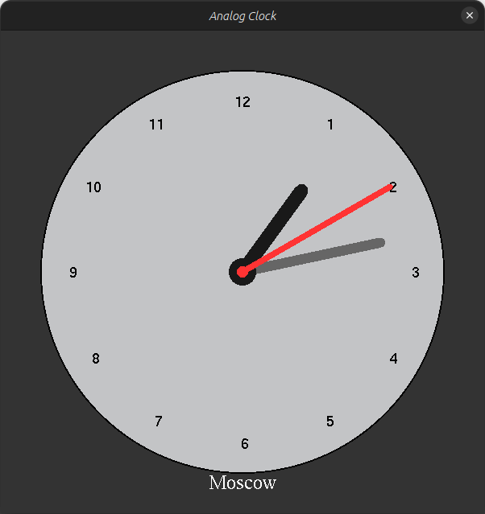

# Analog Clock Project


This is a simple analog clock project implemented in C++ using the SDL2 and OpenGL libraries. It displays an analog clock with customizable attributes, including its position, size, time zone offset, and label.

## Table of Contents

- [Analog Clock Project](#analog-clock-project)
  - [Table of Contents](#table-of-contents)
  - [Features](#features)
  - [Dependencies](#dependencies)
  - [Installation](#installation)
  - [Usage](#usage)
## Features

- Displays an analog clock with hours, minutes, and seconds hands.
- Allows customization of the clock's position, size, label, and time zone offset.
- Real-time clock updates based on the system time.
- Simple and clean C++ code.

## Dependencies

This project relies on the following libraries:

- SDL2: Simple DirectMedia Layer is a cross-platform development library designed to provide low-level access to audio, keyboard, mouse, joystick, and graphics hardware via OpenGL.
- OpenGL: The OpenGL graphics rendering library.
- GLUT: The OpenGL Utility Toolkit, used for bitmap character rendering.

Make sure you have these libraries installed on your system before compiling and running the project.

## Installation

To compile and run this project, follow these steps:

1. Clone this repository to your local machine:

   ```bash
   git clone <https://github.com/Spiraks/AnalogClock>
   ```

2. Navigate to the project directory:

   ```bash
   cd AnalogClock
   ```

3. Compile the project using a C++ compiler (e.g., g++):

   ```bash
   g++ -o analog_clock main.cpp ClockWindow.cpp AnalogClock.cpp -lSDL2 -lGL -lglut
   ```

4. Run the compiled executable:

   ```bash
   ./analog_clock
   ```

## Usage

Upon running the program, you will see an analog clock window displaying the current time. The clock has a label indicating the time zone (default is "Moscow").

- The clock hands represent the current time, with the hour hand in red, minute hand in gray, and second hand in white.
- The clock numbers are displayed around the dial, indicating hours 1 through 12.
- Here is the file structure `main.cpp ` for a test run of your project:

```cpp
#include <SDL2/SDL.h>
#include <GL/gl.h>
#include <GL/glut.h>
#include "AnalogClock.h"
#include "ClockWindow.h"

int main(int argc, char *args[])
{
    // Initialize GLUT and SDL
    glutInit(&argc, args);
    SDL_Init(SDL_INIT_VIDEO);

    // Create a ClockWindow and an AnalogClock
    ClockWindow clockWindow(800, 850);
    AnalogClock my_clock(0, 250, 150, 3, "Moscow", clockWindow);

    bool quit = false;
    SDL_Event e;

    // Main loop
    while (!quit)
    {
        // Event handling
        while (SDL_PollEvent(&e) != 0)
        {
            if (e.type == SDL_QUIT)
            {
                quit = true;
            }
        }

        // Clear the rendering buffer
        clockWindow.Clear();

        // Draw the clock
        my_clock.Draw();

        // Swap buffers for display
        clockWindow.SwapBuffers();

        // Delay to control the clock update rate (in milliseconds)
        SDL_Delay(1000);
    }

    // Cleanup and exit
    SDL_Quit();
    return 0;
}
```
